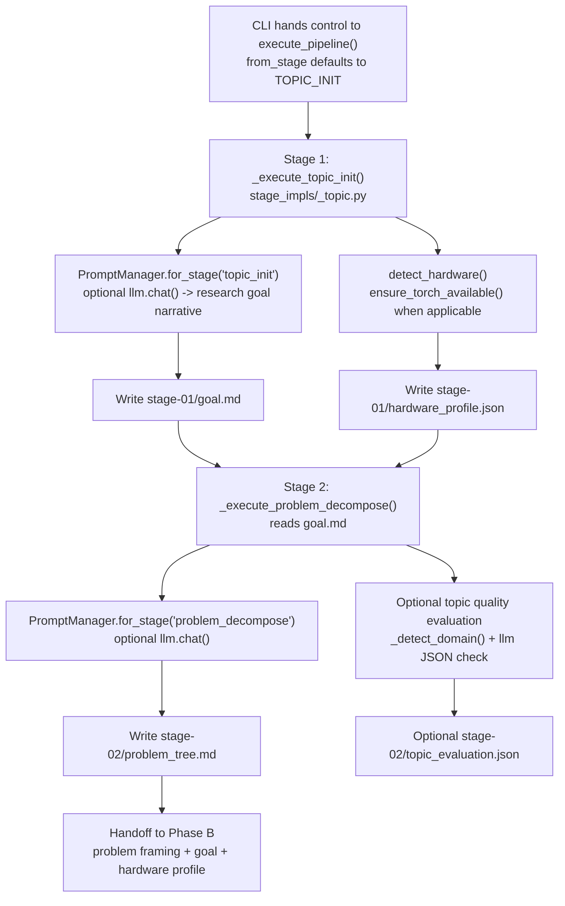
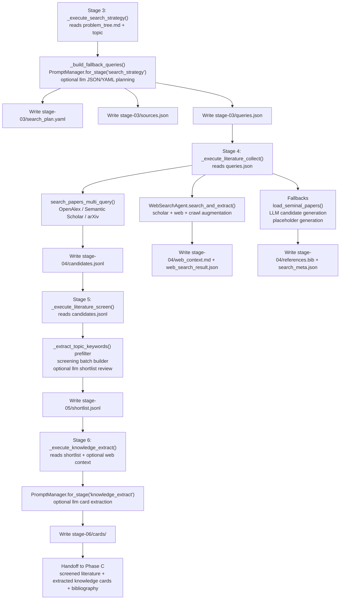
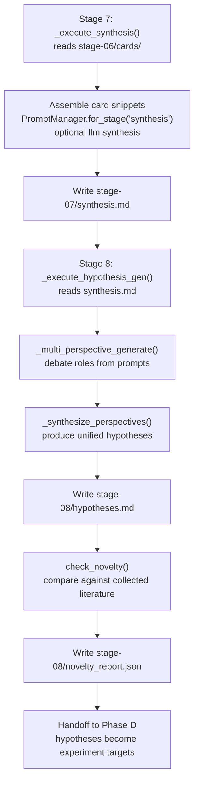
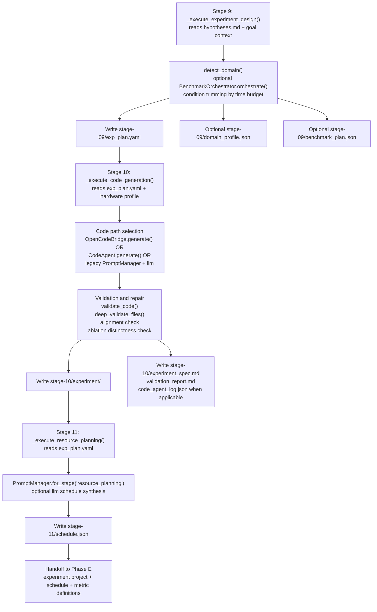
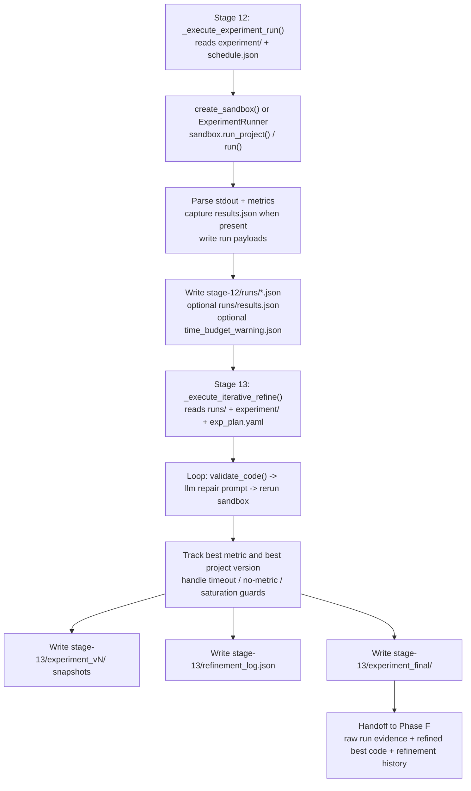
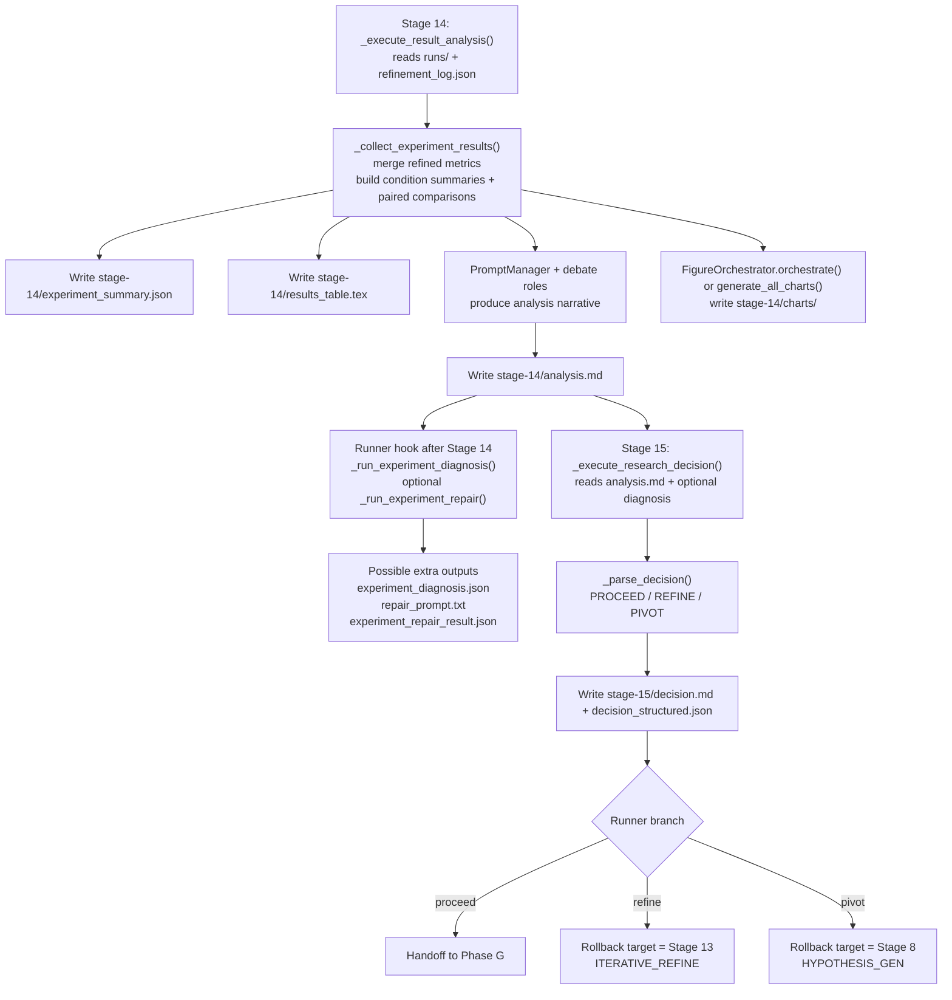
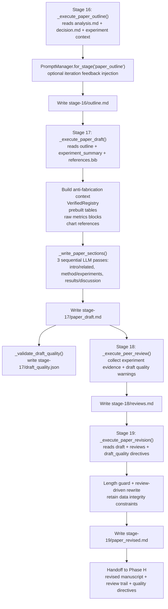
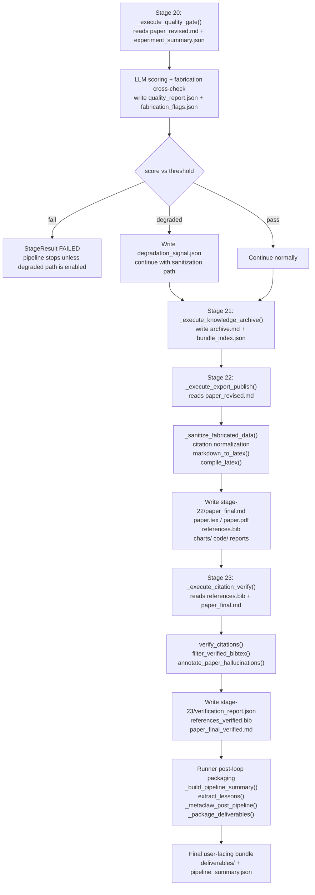

# ResearchClaw `run --topic` Phase Flows

This page documents the internal execution flow for `researchclaw run --topic "..."` at the **phase level**, with explicit **handoff artifacts** between phases.

It is based on the current code path in:

- `researchclaw/cli.py`
- `researchclaw/config.py`
- `researchclaw/llm/__init__.py`
- `researchclaw/pipeline/runner.py`
- `researchclaw/pipeline/executor.py`
- `researchclaw/pipeline/stage_impls/*.py`

## Entry point into the phased pipeline

Before Phase A starts, the CLI path is:

1. `pyproject.toml` console script → `researchclaw.cli:main`
2. `researchclaw.cli.main()` parses the `run` subcommand
3. `cmd_run()` resolves config, loads `RCConfig`, applies CLI overrides, optionally runs LLM preflight, creates `run_dir`, `AdapterBundle`, and calls `execute_pipeline()`
4. `execute_pipeline()` iterates `STAGE_SEQUENCE`
5. `execute_stage()` validates required inputs, builds a stage-local `PromptManager` and LLM client, and dispatches to the phase's `_execute_*` function

## Phase-to-phase handoff summary

| Phase | Stages | Main outbound artifacts | Main consumers |
| --- | ---: | --- | --- |
| A. Research Scoping | 1-2 | `goal.md`, `hardware_profile.json`, `problem_tree.md` | Phase B, Phase D |
| B. Literature Discovery | 3-6 | `search_plan.yaml`, `queries.json`, `candidates.jsonl`, `references.bib`, `shortlist.jsonl`, `cards/` | Phase C, Phase G |
| C. Knowledge Synthesis | 7-8 | `synthesis.md`, `hypotheses.md`, `novelty_report.json` | Phase D |
| D. Experiment Design | 9-11 | `exp_plan.yaml`, `domain_profile.json`, `benchmark_plan.json`, `experiment/`, `experiment_spec.md`, `schedule.json` | Phase E |
| E. Experiment Execution | 12-13 | `runs/`, `results.json`, `time_budget_warning.json`, `experiment_final/`, `refinement_log.json` | Phase F, Phase H |
| F. Analysis & Decision | 14-15 | `analysis.md`, `experiment_summary.json`, `results_table.tex`, `charts/`, `decision.md`, `decision_structured.json`, `experiment_diagnosis.json`, `repair_prompt.txt` | Phase G, runner rollback logic |
| G. Paper Writing | 16-19 | `outline.md`, `paper_draft.md`, `draft_quality.json`, `reviews.md`, `paper_revised.md` | Phase H |
| H. Finalization | 20-23 | `quality_report.json`, `archive.md`, `bundle_index.json`, `paper_final.md`, `paper.tex`, `paper.pdf`, `references.bib`, `verification_report.json`, `paper_final_verified.md` | deliverables packaging |

## Phase A — Research Scoping

**Stages:** `TOPIC_INIT` (1), `PROBLEM_DECOMPOSE` (2)

**Primary handoff out:** `goal.md`, `hardware_profile.json`, `problem_tree.md`

### Phase A handoff points

- `goal.md` seeds the problem decomposition prompt and later context preambles.
- `hardware_profile.json` is reused in experiment planning and code generation.
- `problem_tree.md` is the main input to search strategy generation.

## Phase B — Literature Discovery

**Stages:** `SEARCH_STRATEGY` (3), `LITERATURE_COLLECT` (4), `LITERATURE_SCREEN` (5), `KNOWLEDGE_EXTRACT` (6)

**Primary handoff out:** `queries.json`, `candidates.jsonl`, `references.bib`, `shortlist.jsonl`, `cards/`

### Phase B handoff points

- `queries.json` is the execution plan for real literature search.
- `references.bib` becomes the citation source used later in paper drafting and verification.
- `shortlist.jsonl` narrows the candidate set before structured knowledge extraction.
- `cards/` is the direct input for synthesis.

## Phase C — Knowledge Synthesis

**Stages:** `SYNTHESIS` (7), `HYPOTHESIS_GEN` (8)

**Primary handoff out:** `synthesis.md`, `hypotheses.md`, `novelty_report.json`

### Phase C handoff points

- `synthesis.md` summarizes clustered findings and gaps.
- `hypotheses.md` is the main semantic input for experiment design.
- `novelty_report.json` is advisory but useful for downstream framing.

## Phase D — Experiment Design

**Stages:** `EXPERIMENT_DESIGN` (9), `CODE_GENERATION` (10), `RESOURCE_PLANNING` (11)

**Primary handoff out:** `exp_plan.yaml`, `experiment/`, `experiment_spec.md`, `schedule.json`

### Phase D handoff points

- `exp_plan.yaml` defines datasets, baselines, ablations, metrics, and compute budget.
- `experiment/` is the runnable project used by sandbox or other execution backends.
- `schedule.json` is the execution plan consumed by the run stage.

## Phase E — Experiment Execution

**Stages:** `EXPERIMENT_RUN` (12), `ITERATIVE_REFINE` (13)

**Primary handoff out:** `runs/`, `results.json`, `refinement_log.json`, `experiment_final/`

### Phase E handoff points

- `runs/*.json` provides raw evidence for result analysis.
- `refinement_log.json` captures iterative repair history and best metric/version.
- `experiment_final/` is later packaged into release artifacts.

## Phase F — Analysis & Decision

**Stages:** `RESULT_ANALYSIS` (14), `RESEARCH_DECISION` (15)

**Primary handoff out:** `analysis.md`, `experiment_summary.json`, `results_table.tex`, `charts/`, `decision.md`

### Phase F handoff points

- `experiment_summary.json` is the structured data backbone for writing, quality checks, export, and verification.
- `analysis.md` provides the narrative interpretation of experimental evidence.
- `decision.md` controls whether the pipeline advances or recursively rolls back.

## Phase G — Paper Writing

**Stages:** `PAPER_OUTLINE` (16), `PAPER_DRAFT` (17), `PEER_REVIEW` (18), `PAPER_REVISION` (19)

**Primary handoff out:** `outline.md`, `paper_draft.md`, `draft_quality.json`, `reviews.md`, `paper_revised.md`

### Phase G handoff points

- `outline.md` stabilizes the structure before the large drafting pass.
- `paper_draft.md` is reviewed both by peer-review stage logic and quality validators.
- `draft_quality.json` feeds revision directives into Stage 19.
- `paper_revised.md` is the manuscript evaluated by the final quality gate.

## Phase H — Finalization

**Stages:** `QUALITY_GATE` (20), `KNOWLEDGE_ARCHIVE` (21), `EXPORT_PUBLISH` (22), `CITATION_VERIFY` (23)

**Primary handoff out:** quality and archive reports, final paper artifacts, verified bibliography, verified paper

### Phase H handoff points

- `quality_report.json` determines whether the finalization path is pass, fail, or degraded.
- `paper_final.md` and `paper.tex` are the canonical publication outputs before citation verification.
- `verification_report.json` and `references_verified.bib` become the final citation integrity record.
- `deliverables/` is assembled after the pipeline loop ends, not as a standalone stage.

## Cross-phase control-flow notes

### Gate stages

- Stage 5 (`LITERATURE_SCREEN`)
- Stage 9 (`EXPERIMENT_DESIGN`)
- Stage 20 (`QUALITY_GATE`)

These are checked in `researchclaw/pipeline/stages.py` and enforced in `execute_stage()` via `gate_required()`.

### Recursive rollback points

- `REFINE` at Stage 15 rolls back to Stage 13 (`ITERATIVE_REFINE`)
- `PIVOT` at Stage 15 rolls back to Stage 8 (`HYPOTHESIS_GEN`)

The recursion is handled in `researchclaw/pipeline/runner.py` by a second call to `execute_pipeline(from_stage=rollback_target)`.

### Runner-managed side effects

These happen outside any single phase diagram but are important for handoff integrity:

- `checkpoint.json` updates after successful stages
- `heartbeat.json` updates after every stage
- optional knowledge-base writes via `write_stage_to_kb()`
- experiment diagnosis / repair hook after Stage 14
- lesson extraction and MetaClaw post-processing after the loop
- final `deliverables/` packaging after all stage execution is done
